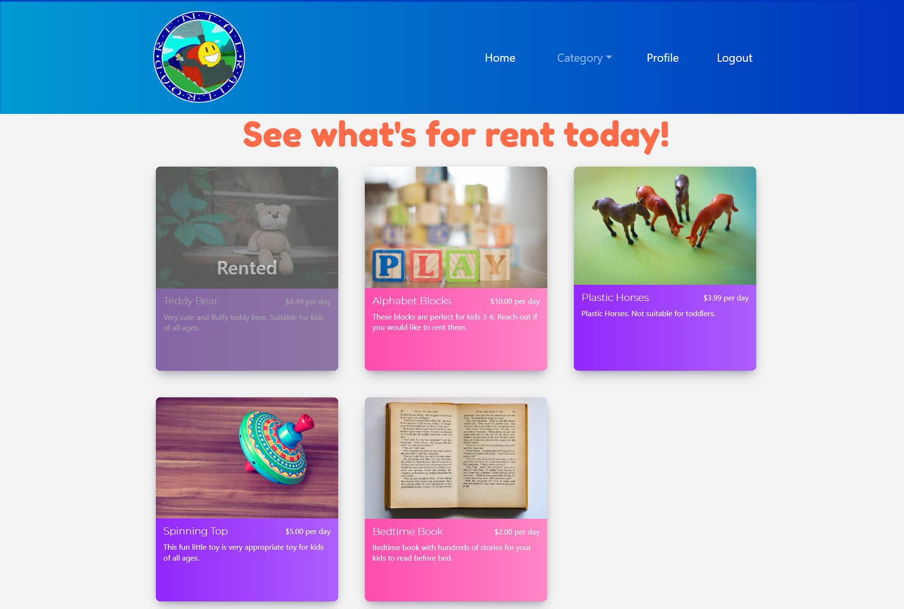
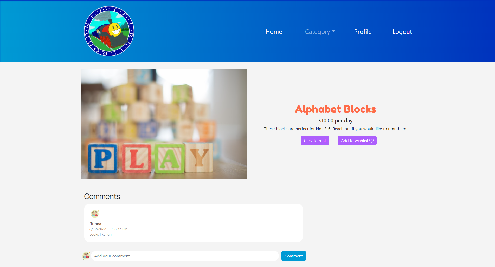

# Rental Railroad

This MERN stack single-page application delivers a user-driven marketplace where users can rent out their items and rent items from others.

## Table of Contents

- [Purpose](#purpose)
- [Collaborators](#collaborators)
- [Goal](#goal)
- [Technology Used](#technology-used)
- [Usage](#usage)
- [Deployment](#deployment)
- [License](#license)

## Purpose

The purpose of this project is to address parents' and caregivers' need to obtain items for their children that they do not wish to keep long-term. Children grow so fast and often require things they're only going to use once, for example, costumes, or for a short time, for example, infant toys. For that reason, we have created a space that allows users to rent out their items and rent items from others.

We have designed a user-friendly and user-driven marketplace for parents and caregivers to interact with each other and fill these temporary needs.

## Collaborators

- [Rajeswari Marimuthu](https://github.com/rajeswarivmarimuthu)
- [Logan Monson](https://github.com/Loggamon)
- [Roman Kutsel](https://github.com/rkutsel)
- [Courtney Struelens](https://github.com/struelensc)

## Goal

The goal is to deliver a single-page full-stack application for users to interact.

The home page of Rental Railway allows users to view all rentals on the platform. These rentals can be reduced using the category dropdown menu provided on the navigation bar. From the navigation bar, users can also click on `Login` where they can either log in or create a profile which will allow them to rent out items, comment on other users' items, rent items, and save items to a wishlist.

From the user's profile page, the user will see a `My Rentals`, `Wishlist`, and an `Order History` tab. From the `My Rentals` tab, the user can click the `Add Product` button which will direct them to fill out a form that will list a new product to rent. This new product will be listed under the user's `My Rentals` tab until removed. When a user adds a product to their wishlist, that product will populate under the user's `Wishlist` tab. When a user completes an order, the details will be cataloged under the `Order History` tab.

From anywhere a product card is populated, the user can click on the card to be shown the product details page. This page will show the user the product photo, name, description, price per day, and comments. From this page, if the user isn't the owner, the user can leave a comment about the product, click on the `Add to wishlist` button, and click on the `Rent` button. If the owner is viewing their product's details page, the owner can click on the `Check Out` or `Check In` button and the `Remove` button.

## Technology Used

- HTML
- CSS and Bootstrap
- Javascript
- React from the front end
- GraphQL with a Node.js and Express.js server
- MongoDB and the Mongoose ODM for the database
- Firebase
- Stripe for payment

## Usage

To get started, from the root directory run `npm run develop` which should build all components and start the client and server components, and redirect you to http://localhost:3000. Optionally you can run `npm run seed` which will load the database with data.

## Deployment

See below for a screenshot of the application and a link to the deployed webpage.

https://rental-railroad.herokuapp.com/

### Homepage

### Product Page

## License

See the [LICENSE](LICENSE.md) file for license rights and limitations (MIT License).
